<div align="center">

<picture>
  <source media="(prefers-color-scheme: dark)" srcset="docs/media/hero-logo-dark.png">
  
</picture>

### It's how you say "JWT."

**Decode, inspect & verify JSON Web Tokens — 100% in your browser, offline by default.**


<br>

<picture>
  <source media="(prefers-color-scheme: dark)" srcset="docs/media/paste-decode-dark.gif">
  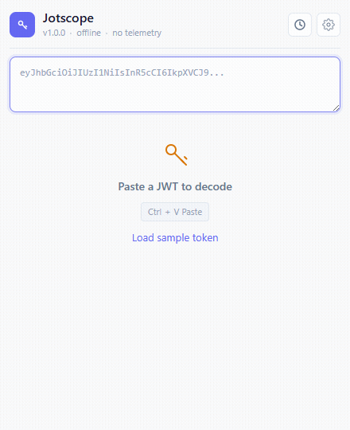
</picture>

<br>

**[Features](#features)** · **[Install](#install-unpacked)** · **[Privacy](#privacy--permissions)** · **[Development](#development--tests)**

</div>

> **Status:** Pre-release. Installable now as an unpacked extension ([see below](#install-unpacked)); a Chrome Web Store listing is planned. Feedback and issues welcome.

---

## Why Jotscope

- 🔒 **Private by design** — decoding never touches the network. The *only* outbound request the extension can make is an **opt-in** fetch of an issuer's public keys for signature verification (off by default).
- ⚡ **Instant** — auto-decodes the moment you paste; finds tokens buried in URLs and OAuth callbacks.
- 🧠 **Actually readable** — a visual claim view with plain-English tooltips, type colors, chips, and a collapsible tree for nested claims.
- 🪶 **Zero runtime dependencies, no build step** — pure vanilla JS. The source *is* what ships, so it's trivial to audit.

---

## Features

- **Instant decode** — paste and it's decoded; pulls tokens out of URLs & OAuth-callback text.
- **Readable claims** — type colors, plain-English tooltips (RFC 7519 + OIDC + vendor), chips, and a collapsible tree for nested claims.
- **Privileged-role flagging** — `admin` / `superuser` / `*-admin` stand out.
- **Live lifetime** — real-time countdown and a Valid → Expiring → Expired status.
- **Signature verification** — distinct states, including an `alg: none` warning; opt-in JWKS fetch.
- **Visual ↔ JSON** per panel · **searchable history** · **settings** (timestamps, defaults, thresholds) · **dark mode**.

The rest of this section shows each in action.

### Decode at a glance

Paste a token and get the whole picture instantly — who it's for, whether it's valid, and how long it has left, with a live countdown.

<div align="center">
  <picture>
    <source media="(prefers-color-scheme: dark)" srcset="docs/media/02-decoded-overview-dark.png">
    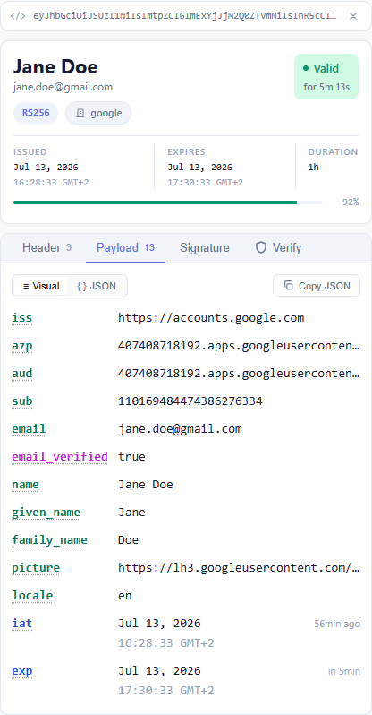
  </picture>
</div>

### A claim view you can actually read

Every claim is color-coded by type, standard claims carry hover/keyboard tooltips (RFC 7519 + OIDC + vendor extensions), `scope`/`groups`/roles render as chips, and timestamps show both the exact date and a relative time.

<div align="center">
  <picture>
    <source media="(prefers-color-scheme: dark)" srcset="docs/media/03-claims-visual-dark.png">
    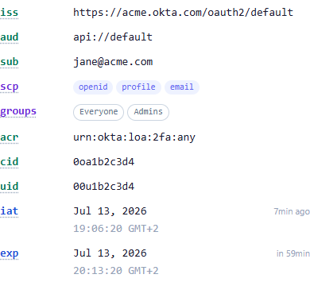
  </picture>
</div>

### Nested claims, unravelled

Provider payloads like Keycloak's `realm_access` / `resource_access` or Firebase's `identities` render as a collapsible tree instead of a wall of JSON — recursive, any depth.

<div align="center">
  <picture>
    <source media="(prefers-color-scheme: dark)" srcset="docs/media/nested-tree-dark.gif">
    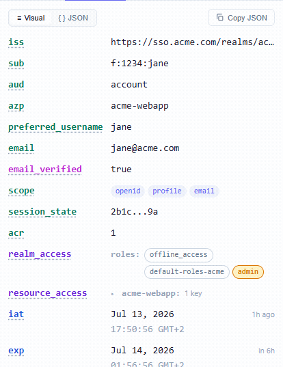
  </picture>
</div>

### Privileged roles, flagged

Roles like `admin`, `superuser`, or any `*-admin` are tinted and bolded so a dangerous grant jumps out.

<div align="center">
  <picture>
    <source media="(prefers-color-scheme: dark)" srcset="docs/media/05-privileged-role-dark.png">
    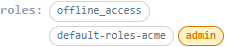
  </picture>
</div>

### Live token lifetime

A real-time countdown and an issued → expires progress bar — watch the status shift **Valid → Expiring → Expired** as the clock runs down.

<div align="center">
  <picture>
    <source media="(prefers-color-scheme: dark)" srcset="docs/media/countdown-dark.gif">
    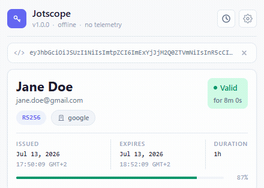
  </picture>
</div>

Every state is distinct — **Valid**, **Expiring soon**, **Expired**, **Not yet active**, and **No expiry**:

<p align="center">
  <picture><source media="(prefers-color-scheme: dark)" srcset="docs/media/08-status-valid-dark.png">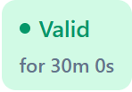</picture>
  <picture><source media="(prefers-color-scheme: dark)" srcset="docs/media/08-status-expiring-dark.png">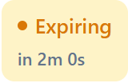</picture>
  <picture><source media="(prefers-color-scheme: dark)" srcset="docs/media/08-status-expired-dark.png">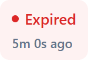</picture>
  <picture><source media="(prefers-color-scheme: dark)" srcset="docs/media/08-status-notyet-dark.png">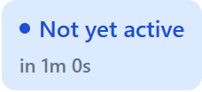</picture>
  <picture><source media="(prefers-color-scheme: dark)" srcset="docs/media/08-status-noexp-dark.png">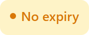</picture>
</p>

### Signature verification

Clear, honest verification states — including a prominent amber warning for unsigned `alg: none` tokens. Verifying a signed token can optionally fetch the issuer's JWKS (the one and only network call, opt-in via Settings).

<div align="center">
  <picture>
    <source media="(prefers-color-scheme: dark)" srcset="docs/media/09-verify-unsigned-dark.png">
    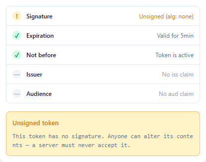
  </picture>
</div>

### Finds tokens anywhere

Paste an OAuth callback URL or a blob of text and Jotscope extracts the tokens for you, with a picker when there's more than one.

<div align="center">
  <picture>
    <source media="(prefers-color-scheme: dark)" srcset="docs/media/11-multi-token-dark.png">
    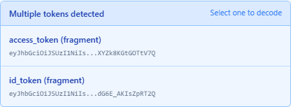
  </picture>
</div>

### Visual ↔ JSON, your call

Prefer raw bytes? Flip any panel to pretty-printed JSON (nested objects included) — same token, two views. Set your default in Settings.

<div align="center">
<table>
<tr>
<td align="center" valign="top">

<strong>Visual</strong><br><br>

<picture>
  <source media="(prefers-color-scheme: dark)" srcset="docs/media/10-visual-dark.png">
  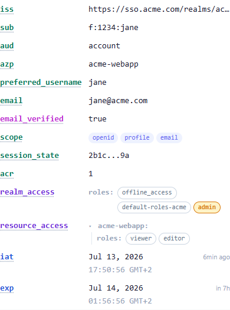
</picture>

</td>
<td align="center" valign="top">

<strong>JSON</strong><br><br>

<picture>
  <source media="(prefers-color-scheme: dark)" srcset="docs/media/10-json-toggle-dark.png">
  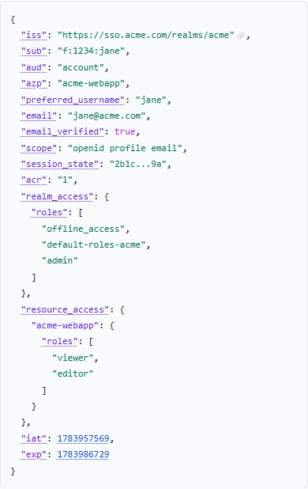
</picture>

</td>
</tr>
</table>
</div>

### History that stays out of your way

Recently decoded tokens are remembered locally, with a searchable, filterable full history and per-entry expiry status.

<div align="center">
  <picture>
    <source media="(prefers-color-scheme: dark)" srcset="docs/media/12-history-dark.png">
    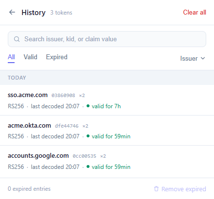
  </picture>
</div>

### Yours to tune

Timestamps in Local / UTC / Both, default tab & view, key-fetching mode, the "expiring soon" threshold, weak-algorithm flagging, and history retention.

<div align="center">
  <picture>
    <source media="(prefers-color-scheme: dark)" srcset="docs/media/13-settings-dark.png">
    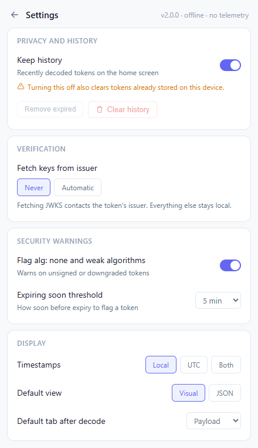
  </picture>
</div>

Plus **dark mode** — follows your system, and every screenshot above adapts automatically.

---

## Install (unpacked)

Primary target: Chromium-based browsers (Chrome, Edge, Brave), minimum Chrome 116. Firefox isn't supported yet — a port is under consideration.

1. Download or clone this repository.
2. Open `chrome://extensions/` (or `edge://extensions/`).
3. Enable **Developer mode** (top-right toggle).
4. Click **Load unpacked** and select the project folder.
5. Pin Jotscope to your toolbar.

---

## Privacy & permissions

Your tokens never leave your browser.

- No analytics, no tracking, **zero runtime dependencies**.
- **The clipboard is read only when you ask** — when you click the *Paste* button or press Ctrl/Cmd+V into the input. Jotscope never reads the clipboard on open, in the background, or on a timer, and nothing read is transmitted or stored beyond the local decode.
- **History & settings are stored only in your browser's `localStorage`** — never synced or sent anywhere. History keeps the **full** recently-decoded tokens so you can revisit them (capped at 150, de-duplicated); clear it, remove expired entries, or turn history off entirely in Settings.
- Decoding is 100% local. **Signature verification can optionally fetch the issuer's public JWKS** — the single outbound request the extension can make. It's **opt-in** (Settings → *Fetch keys* → *Automatic*; default *Never*), sends no token data, and only GETs the issuer's well-known JWKS URL.

| Permission      | Why                                                                                       |
|-----------------|-------------------------------------------------------------------------------------------|
| `storage`       | Save history & settings locally (`localStorage`)                                          |
| `clipboardRead` | Read the clipboard **only** on an explicit paste (Paste button / Ctrl+V) — never automatically |

No host permissions, no `<all_urls>`.

---

## Security

Found a security issue? Please **report it privately** — open a GitHub Security Advisory via the repository's **Security → Report a vulnerability** tab, rather than a public issue. Details in [SECURITY.md](SECURITY.md).

---

## Keyboard shortcuts

| Shortcut       | Action                                  |
|----------------|-----------------------------------------|
| `Ctrl+Enter`   | Decode the token in the input           |
| `Ctrl+Shift+C` | Clear the input                         |
| `Paste`        | Auto-decode (when the input is focused) |
| `Esc`          | Dismiss an open claim tooltip           |

---

## Development & tests

Requires Node 18+ (developed on Node 22).

```bash
npm install
npm test          # regenerates synthetic fixtures, then runs the Playwright suite
```

<details>
<summary>How the tests work</summary>

The end-to-end suite (`tests/popup.spec.js`) loads the unpacked extension in headless Chromium and drives the real popup — asserting the claim tree, privileged-role highlighting, stacked timestamps, tooltip keyboard access, the JSON toggle, and more. `npm test` first runs `scripts/gen-test-tokens.js` to (re)generate `test-tokens.md` with fresh, correctly-timed **synthetic** tokens (random placeholder signatures — never real credentials). Watch it run in a real window with `HEADED=1 npx playwright test`.

</details>

<details>
<summary>Regenerating the README visuals</summary>

Every screenshot, GIF, and icon in this README is generated — not hand-captured — by driving the extension with Playwright and assembling GIFs with ffmpeg:

```bash
npm run gen:media    # → docs/media/*  and  icons/*   (requires ffmpeg on PATH)
```

All assets render from the same synthetic tokens, so they contain no personal or real data and are fully reproducible.

</details>

---

## Contributing

Contributions welcome. Please keep changes:

- **Offline-first** — no new runtime network calls, no runtime dependencies.
- Consistent with the existing vanilla-JS style.
- Covered by `npm test`, and verified in both light and dark mode.

---

## License

[MIT](LICENSE)

<div align="center"><br>

<picture>
  <source media="(prefers-color-scheme: dark)" srcset="docs/media/hero-logo-dark.png">
  
</picture>

<sub>Made for developers who live in tokens.</sub>

</div>
